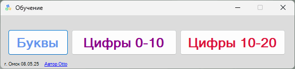
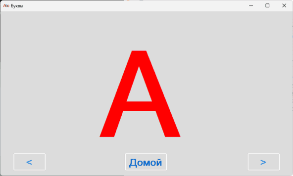
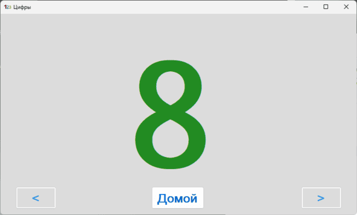
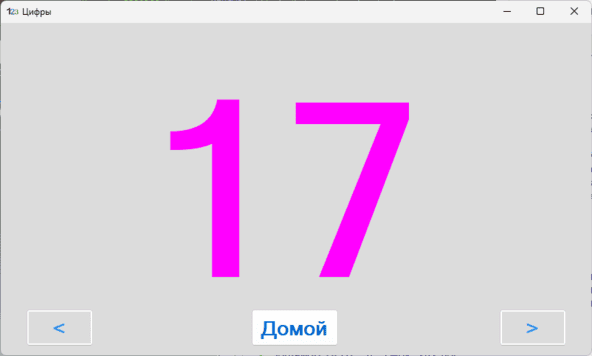

**Буквы-Цифры** - Программа для обучения детей от 2-х лет Русским буквам и цифрам от нуля 0 до 20.

Используется _.NET Framework 4.8.1_

Версия языка C#: _13.0_

_Проект полностью открыт и распространяется по лицензии MIT._

Ссылки на [GitHub](https://github.com/Otto17/Bukvy-Cifry) и [GitFlic](https://gitflic.ru/project/otto/bukvy-cifry).

---

**Возможности:**

*   Огромные, разноцветные буквы и цифры;
*   Озвучивание каждой буквы и цифры;
*   Режимы: полноэкранный и оконный (фиксированного размера);
*   Все звуки вшиты в исполняемый файл (портативная версия программы);
*   Горячие клавиши:
    *   Кнопка "**Домой**" привязана к клавише "**Home**";
    *   Кнопка "**\<**" (_назад_) привязана к клавише "**←**" (_стрелка влево_);
    *   Кнопка "**\>**" (_вперёд_) привязана к клавише "**→**" (_стрелка вправо_);
    *   Для закрытия главного окна программы привязана клавиша "**Esc**".

---

**Скриншоты:**

****
****
****
****

---

**Автор Otto, г. Омск 2025**